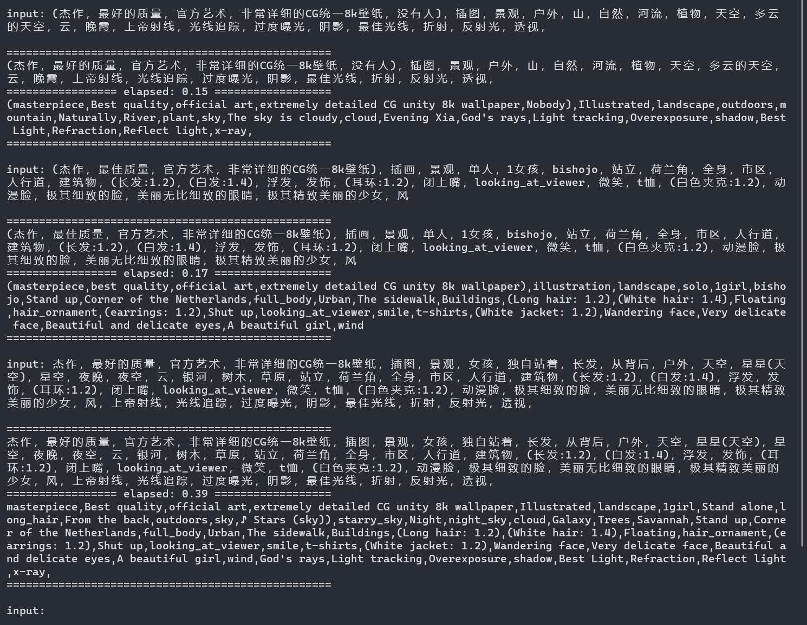

# Prompt Translator

**注意这不是 Stable Diffusion 的扩展插件，只是一个用于翻译 prompt 的轮子**

使用 [Helsinki-NLP/opus-mt-zh-en](https://huggingface.co/Helsinki-NLP/opus-mt-zh-en) 中英机器翻译模型，无需连接在线翻译服务，可离线使用，专注于 Stable Diffusion 的 prompt 中翻英，对输入文本格式做了优化处理，支持在 `custom.csv` 自定义常用的 prompt 翻译匹配，支持中英文混和输入。

支持 GPU 加速，对大量文本批量翻译使用 dataset 优化，在 RTX 4090 上测试，800 字符的中文文本，翻译耗时在 1.5 秒左右，比 CPU 快 3-4 倍，比不使用 dataset 时快 3 倍左右。对于平时输入的 prompt 大约在 100-300 字符之间，耗时基本小于 1 秒。

使用了以下方式处理 `danbooru-0-zh.csv` 中的数据得到 `custom.csv`

1. 保留前5000行
2. 删除包含特殊字符的行，比如`（`，`[^\u4E00-\u9FA5a-zA-Z0-9\s\p{P}]+,`
3. 删除`,`前无中文的行，`^[0-9a-zA-Z\s\p{P}_]+,`
4. 将包含`|`的行拆分成多行 `dev/split_multiple_row.py`
5. 删除我认为无用的行
6. 添加一些常用的 alias

首次运行会自动从 Hugging Face 下载 300MB 的模型，请确保网络通畅。

如果你的显存不够充足，可适当修改 `main.py` 中的 `dataloader_batch_size`

如果经常输入长句子，可适当修改 `main.py` 中的 `model_max_length`

## License

MIT

## Credits

原始 danbooru tag 中文翻译数据 `danbooru-0-zh.csv ` 来自：[https://github.com/DominikDoom/a1111-sd-webui-tagcomplete/discussions/23](https://github.com/DominikDoom/a1111-sd-webui-tagcomplete/discussions/23)

Stable Diffusion扩展：[sd-prompt-translator](https://github.com/studyzy/sd-prompt-translator)

Stable Diffusion扩展：[prompt_translator](https://github.com/ParisNeo/prompt_translator)